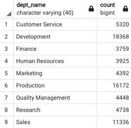

# **Pewlett Hackard Analysis**  


## **Overview of Project**
in this project we are helping a company named "Pewlett Hackard" to get some information about their employees who are retiring soon


### **Purpose**

Our client is a company named "Pewlett Hackard"n they have provided us with all the information they had n their employees in 6 csv files. in this analysis we used four of these files. part of these four file are shown in the images below:
<center>

|*Fig. 1: [Departments](Data/departments.csv)*|
:--:
||

|*Fig. 2: [Employees](Data/employees.csv)*|
:--:
||

|*Fig. 3: [Department_Employees](Data/dept_emp.csv)*|
:--:
||

|*Fig. 4: [Titles](Data/titles.csv)*|
:--:
||
</center>
&nbsp;


&nbsp;

## **Results**  


To perform the analysis we used PostgreSQL and its editor pgAdmin, we created a table for the contents of each file and also determined the relationship between tables if there is any. Here is the query we wrote to create the tables for the contents of four CSV files we used:

```sql
CREATE TABLE departments (
     dept_no VARCHAR(4) NOT NULL,
     dept_name VARCHAR(40) NOT NULL,
     PRIMARY KEY (dept_no),
     UNIQUE (dept_name)
);
CREATE TABLE employees (
     emp_no INT NOT NULL,
     birth_date DATE NOT NULL,
     first_name VARCHAR NOT NULL,
     last_name VARCHAR NOT NULL,
     gender VARCHAR NOT NULL,
     hire_date DATE NOT NULL,
     PRIMARY KEY (emp_no)
);
CREATE TABLE dept_emp (
  emp_no INT NOT NULL,
  dept_no VARCHAR NOT NULL,
  from_date DATE NOT NULL,
  to_date DATE NOT NULL,
  FOREIGN KEY (emp_no) REFERENCES employees (emp_no),
  FOREIGN KEY (dept_no) REFERENCES departments (dept_no)
);
CREATE TABLE titles (
  emp_no INT NOT NULL,
  title VARCHAR NOT NULL,
  from_date DATE NOT NULL,
  to_date DATE NOT NULL,
  FOREIGN KEY (emp_no) REFERENCES employees (emp_no)
);
```
By joining and filtering data in these table we tried to get som information about those employees who will retire in near future and those who can be used as mentors for new employees of the company:

&nbsp;

1. The company told us that anyone born between 1952 and 1955 will begin to retire so using the query below we joined and filter the data in "employees" and "titles" tables to get the names and titles of the employees born between 1952 and 1955 and export them to a CSV file([retirement_titles.csv](Data/retirement_titles.csv)):  

    ```sql
    SELECT e.emp_no,
        e.first_name,
        e.last_name,
        ti.title,
        ti.from_date,
        ti.to_date
    INTO retirement_titles
    FROM employees as e
    INNER JOIN titles as ti
    ON e.emp_no = ti.emp_no
    WHERE e.birth_date BETWEEN '1952-01-01' AND '1955-12-31'
    ORDER BY e.emp_no ASC;
    ```
    Fig. 5 shows a view of the table we created using the above query:

    <center>

    |*Fig. 5: retirement_titles*|
    :---:
    ||
    </center>
    &nbsp;

2. The table we created for "retirement_titles" contains duplicates for the employees who have worked in two or more roles in the company during their career. So, using the query below we dropped the duplicates and picked only the last title for each employee ([unique_titles.csv](Data/unique_titles.csv)):

    ```sql
    SELECT DISTINCT ON (emp_no) emp_no,
				first_name,
				Last_name,
				title
    INTO unique_titles
    FROM retirement_titles
    ORDER BY emp_no, to_date DESC;
    ```
    <center>

    |*Fig. 6: unique_titles*|
    :---:
    ||
    </center>
    &nbsp;

3. To retrieve the potential number retirement-ready employees in each title we used the query below ([retiring_titles.csv](Data/retiring_titles.csv)):

    ```sql
    SELECT count(ut.emp_no), ut.title
    INTO retiring_titles
    FROM unique_titles as ut
    GROUP BY ut.title
    ORDER BY count DESC;
    ```
    <center>

    |*Fig. 7: retiring_titles*|
    :---:
    ||
    </center>
    &nbsp;

    Fig. 7, demonstrates that:
    - 90,938 employees are ready for retirement
    - Most of the employees who are going to retire have "Senior Engineer" title
    - there are only two manager who are going to retire However. 
    &nbsp;

    However, the "unique_title " table may contain the employees who are already retired and are no longer a part of the company. (we discuss this latter in the summary section)

4. We also filtered the data for the employees born in 1965 and are currently employed to determine those who are eligible to participate in mentorship program ([mentorship_eligibilty.csv](Data/mentorship_eligibilty.csv)):

    ```sql
    SELECT DISTINCT ON (e.emp_no) e.emp_no,
	e.first_name,
	e.last_name,
	e.birth_date,
	de.from_date,
	de.to_date,
	ti.title
    INTO mentorship_eligibilty
    FROM employees as e
    INNER JOIN dept_emp as de
        ON e.emp_no = de.emp_no
    INNER JOIN titles as ti
        ON e.emp_no = ti.emp_no
    WHERE (e.birth_date BETWEEN '1965-01-01' AND '1965-12-31') AND (de.to_date = ('9999-01-01'))
    ORDER BY e.emp_no;
    ```
    <center>

    |*Fig. 8: mentorship_eligibilty*|
    :---:
    ||
    </center>
    &nbsp;

    According t this analysis there are 1,549 employees eligible for this program.


## **summary**  

- As we mentioned in the part 3 of the previous section the the "unique_title " table may contain the employees who are already retired because we had not filtered the data to retrieve only the current employees of the company, so, in order to determine the exact number of the roles that will need to be filled we wrote the query below to only pick the employees who are currently employed in their most recent roles:([current_unique_titles.csv](Data/current_unique_titles.csv), [current_retiring_titles.csv](Data/mentorship_eligibilty.csv))
    ```sql
    SELECT DISTINCT ON (emp_no) emp_no,
				first_name,
				Last_name,
				title,
				to_date
    INTO current_unique_titles
    FROM retirement_titles
    WHERE (retirement_titles.to_date = ('9999-01-01'))
    ORDER BY emp_no, to_date DESC;


    SELECT count(cut.emp_no), cut.title
    INTO current_retiring_titles
    FROM current_unique_titles as cut
    GROUP BY cut.title
    ORDER BY count DESC;
    ```
    <center>

    |*Fig. 9: current_retiring_titles*|
    :---:
    ||
    </center>
    &nbsp;

    According to Fig. 9 there will be 72,458 roles to be filled, "Senior Engineer" and "Senior Staff" will be most required ones

- Writing the following queries we found that the company may not have enough mentors in each department to train the big number of new employees joining those departments in the near future to replace the retired ones ([department_retirement.csv](Data/department_retirement.csv), [department_mentors.csv](Data/department_mentors.csv)):
    ```sql
    SELECT count(cut.emp_no), d.dept_name
    INTO department_retirement
    FROM current_unique_titles as cut
    INNER JOIN dept_emp as de ON cut.emp_no = de.emp_no
    INNER JOIN departments as d ON de.dept_no = d.dept_no
    WHERE de.to_date = '9999-01-01'
    GROUP BY d.dept_name
    ORDER BY count DESC;


    SELECT count(me.emp_no), d.dept_name
    INTO department_mentors
    FROM mentorship_eligibilty as me
    INNER JOIN dept_emp as de ON me.emp_no = de.emp_no
    INNER JOIN departments as d ON de.dept_no = d.dept_no
    WHERE de.to_date = '9999-01-01'
    GROUP BY d.dept_name
    ORDER BY count DESC;
    ```

    <center>

    |*Fig. 10: department_retirement*|
    :---:
    ||
    </center>
    &nbsp;
    <center>

    |*Fig. 11: department_mentors*|
    :---:
    ||
    </center>
    &nbsp;

According to Fig. 10 and Fig. 11, each mentor will have around 50 new employees to train in each department, which is a big number of trainees to focus on.